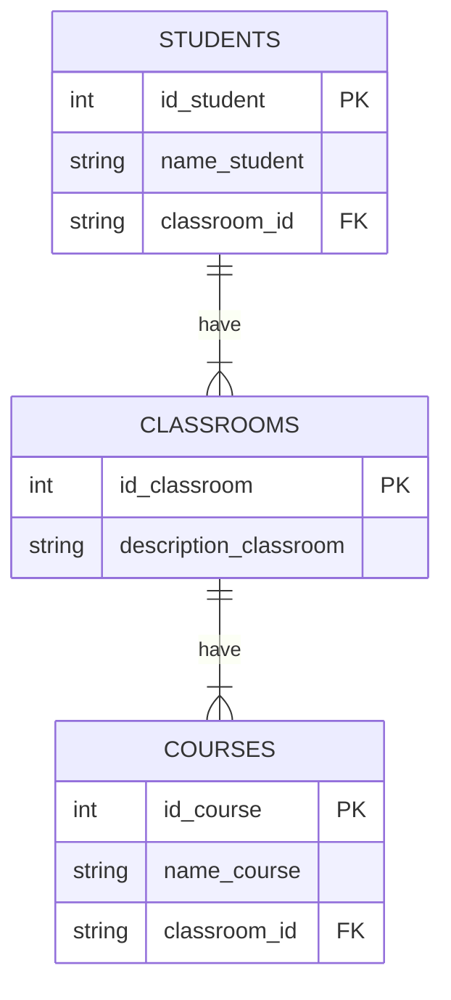

# Ejercicio 1: Students Classrooms Courses

## Diagrama ER con Mermaid

## Tabla normalizada: 1FN

## Tabla normalizada: 3FN

## Diagrama ER (de Chen)

## Diagrama UML (Database Schema - Patas de gallo)

